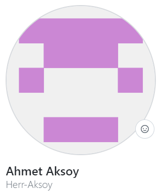
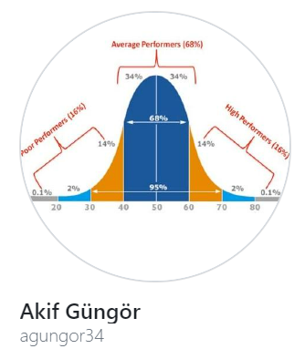
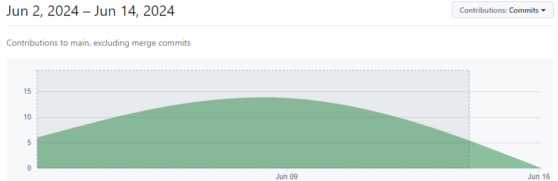
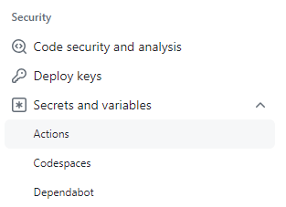
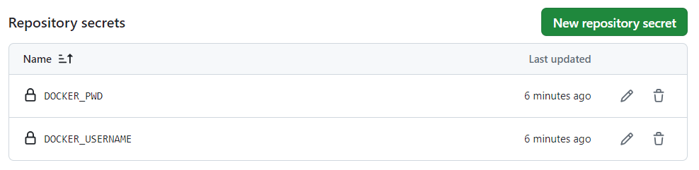

# 3D-Portfolio-Project

<br><br>

## Project Owners
<table>
  <tr>
    <td></td>
    <td></td>
    <td></td>
  </tr>
  <tr>
    <td><a href="https://www.linkedin.com/in/aksoy-ahmet/" title="LinkedIn Profile">---------->Ahmet Aksoy<----------</a></td>
    <td><a href="https://www.linkedin.com/in/mehmet8sever/" title="LinkedIn Profile">---------->Mehmet Sever<---------</a></td>
    <td><a href="" title="LinkedIn Profile">----------->Akif Güngör<----------</a></td>
  </tr>
</table>
<br><br>
<table>
  <tr>
    <td colspan="3"></td>
  </tr>
  <tr>
    <td><a href="https://www.linkedin.com/in/aksoy-ahmet/" title="LinkedIn Profili">Ahmet Aksoy</a></td>
  </tr>
</table>
  
<br><br>

## Strengthen Your Professional Image with Our 3D Portfolio Project

Creating our 3D-Portfolio-Project helps strengthen your personal brand and establish a professional image. By effectively showcasing your resume and achievements, you can leave a positive impression on potential employers or partners. Moreover, sharing your contact information expands your professional network and directs traffic to social media and other platforms. Regularly updating your portfolio to highlight recent projects and new skills demonstrates your current and active status. Building your own portfolio website or page allows for uniqueness and creativity, enabling you to shape design, content, and presentation according to your personal style. This empowers you to independently narrate your story and professional journey.

## Project Technologies

<table>
  <tr>
    <td><strong>Infrastructure:</strong></td>
    <td>AWS (Amazon Web Services), Terraform</td>
  </tr>
  <tr>
    <td><strong>Containerization & Orchestration:</strong></td>
    <td>Docker</td>
  </tr>
  <tr>
    <td><strong>CI/CD Tools:</strong></td>
    <td>GitHub Actions</td>
  </tr>
  <tr>
    <td><strong>Frontend:</strong></td>
    <td>HTML, CSS, JavaScript</td>
  </tr>
  <tr>
    <td><strong>Backend:</strong></td>
    <td>Python, Flask</td>
  </tr>
  <tr>
    <td><strong>Version Control:</strong></td>
    <td>GitHub</td>
  </tr>
  <tr>
    <td><strong>Cloud Services:</strong></td>
    <td>AWS EC2, AWS VPC</td>
  </tr>
  <tr>
    <td><strong>Container Registry:</strong></td>
    <td>Dockerhub</td>
  </tr>
</table>
  
<br><br>

## Infrastructure Process

With Terraform, we create AWS resources including Virtual Private Cloud (VPC), Elastic Compute Cloud (EC2) instances, key pairs, security groups, and various outputs. When provisioning EC2 instances, we utilize user data. This user data installs software such as Docker, Git, Flask, and pip. Our application consists of HTML, CSS, and JavaScript code, tailored to run on Flask. Using Docker, we package this application to run within a container and execute the Python (.py) file. For email functionality in our application, we configure the Python file accordingly.

To automatically build a Docker image of our application, we leverage GitHub Actions. In this process, a job is triggered to build a Docker image and push it to Docker Hub. Connecting via SSH to our EC2 instance, we deploy this Docker image and access our application via the specified port.
<br><br>

## CI/CD Process

CI/CD (Continuous Integration/Continuous Deployment) process is a method used to enhance efficiency in software development. This process enables rapid development, testing, and deployment of software projects, while reducing manual intervention. It facilitates continuous integration and continuous deployment.

How It Works?

<strong>Build and Push Stage (build-and-push.yml):</strong> This stage is a YAML file configured with GitHub Actions or similar CI/CD tools. It automatically runs with every new code commit (push operation). It builds the latest version of the Docker image and pushes it to Dockerhub or another container registry.

For example, the build-and-push.yml file may include these steps:

Compiling and testing the code  
Building the Docker image  
Pushing the Docker image to Dockerhub  

<strong>Automatic Triggering:</strong>Automatic Triggering: GitHub or other CI/CD tools configure this YAML file to automatically execute these steps with every new code commit. This eliminates the need for developers or teams to manually initiate these processes with each code change.

<strong>Sending the Latest Version to the Repository:</strong> The Docker image is automatically updated and sent to the container registry with each push operation. This ensures that the most current and functional version is always available.

This process has become an integral part of modern software development practices, enhancing the effectiveness, reliability, and speed of software projects.

### Creating .github\workflows\build-and-push.yml

In order to push images to the Docker Hub repo, we create secrets in the Githup account and use them in the file.



We create a build-and-push.yaml file to use Github Action. And we specify the secrets inside.  

**❗ Sample Code line**

```sh

    - name: Docker Login
      run: docker login --username ${{ secrets.DOCKER_USERNAME }} -p ${{ secrets.DOCKER_PWD }}

```

We go to Repo > Setting > Secrets and variables > Actions and create "New repository secrets" here.




```sh


```


```sh


```


# Video-1 30 dk

Source kodlar kullanilan iconlar 

https://boxicons.com/

adresinden alinmistir


